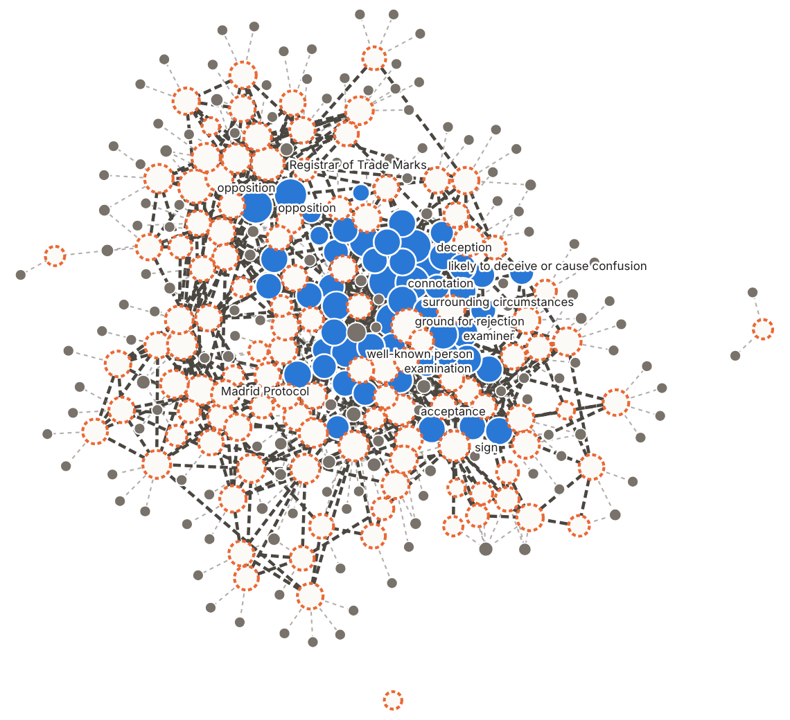
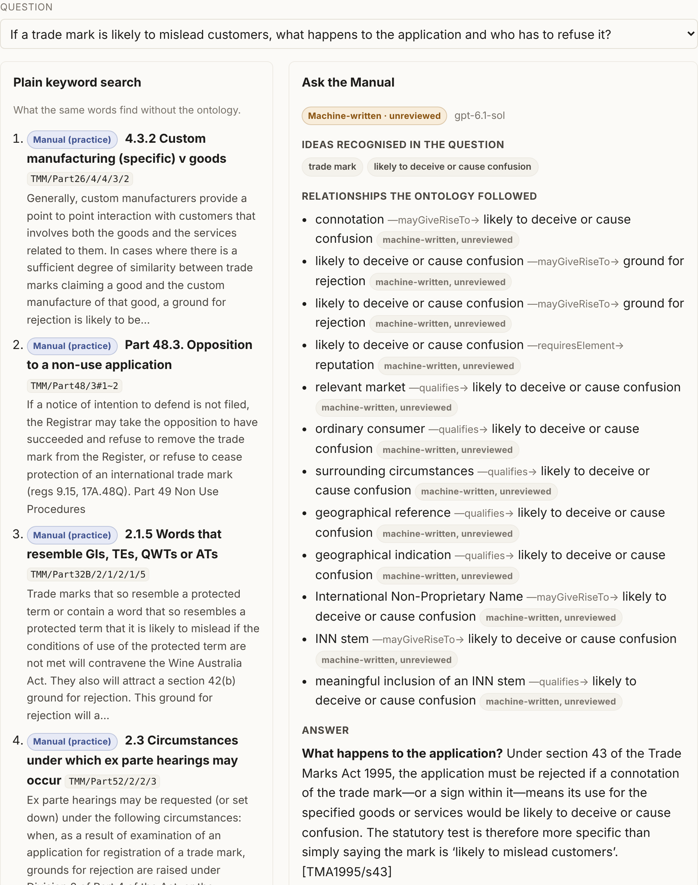

# Pitch pack — what an ontology adds to the Trade Marks Manual (D4)

**Status: draft for the owner, 2026-10-07.** The slide deck is a private artifact
only the owner can open: <https://claude.ai/artifact/A8w4WZ99aFkm1w4MyfQrFA>. This
file is the repository's copy of its substance. **Which results become claims is
the owner's decision** (`CLAUDE.md` §3a; OQ-0029). Nothing below claims; it reports.

Everything machine-written is unreviewed: no expert has read any of it.

## What was built (D1)

| | Signed by an expert | Written by a machine, unreviewed |
|---|---|---|
| Concepts | 52 | 115 |
| Relationships between concepts | 35 | 573 |

- 9,206 links from concepts to passages; 1,663 of the Manual's 2,460 passages name
  at least one concept. 145 provisions of the Act and Regulations hang off them.
- **163 of 167 concepts sit in one connected piece**; the map has 3 islands, the
  largest holding 308 of 312 nodes. Outside it: trade mark and applicant (never
  paired, by design: they are named everywhere), Board (all six candidate links
  judged unrelated) and protected wine expression (never named verbatim).
- The graph passes its shape checks (SHACL) with 0 defects. Every machine-written
  record carries the model, the date, the passage it rests on with an exact span
  and hash, and `review_status: unreviewed`.

## Ask the Manual (D2)

An answer for every one of the 129 benchmark questions, beside plain keyword
search: the ideas recognised, the relationships followed, the passages with the
Manual and the Act labelled apart, and a cited answer stamped unreviewed.

- Every answer carries at least one citation located verbatim by code; 4.7 on
  average. 81 of 129 cite the Act or Regulations as well as the Manual.
- 14 of 129 declined the part of a question that asked how an application would be
  decided.

## The measurement (D3)

Three systems, fixed before any grading: **keyword** (word matching, like a search
box), **hybrid** (keyword plus meaning vectors — good search, no ontology) and
**ontology** (hybrid plus recognised concepts, their wording and their linked
passages). 119 questions written by `gpt-5.4-mini` in four kinds, plus the
expert's 10 signed questions; every pooled passage (2,236) graded 0–3 by
`gpt-6.1-sol`. Top-ten quality (nDCG@10), paired bootstrap 95% intervals.

| Questions | n | Keyword | Hybrid | Ontology | Ontology − keyword | Ontology − hybrid |
|---|---|---|---|---|---|---|
| All | 129 | 0.726 | 0.845 | 0.795 | +0.069 [+0.031, +0.108] **established** | −0.050 [−0.079, −0.024] **established, worse** |
| Everyday problem | 29 | 0.677 | 0.849 | 0.810 | +0.132 [+0.052, +0.214] **established** | −0.039 [−0.094, +0.007] |
| Lookup | 30 | 0.774 | 0.896 | 0.828 | +0.054 [+0.000, +0.113] established, just | −0.067 [−0.112, −0.026] **established, worse** |
| Cross-Part | 30 | 0.730 | 0.834 | 0.761 | +0.031 [−0.041, +0.113] | −0.074 [−0.139, −0.014] **established, worse** |
| Impact | 30 | 0.734 | 0.840 | 0.798 | +0.065 [−0.027, +0.162] | −0.041 [−0.117, +0.021] |
| The expert's 10 | 10 | 0.686 | 0.735 | 0.749 | +0.063 [−0.044, +0.166] | +0.013 [−0.019, +0.045] |

Full report: `data/derived/reports/measure.md`; per-question scores:
`data/derived/bench/results.json`.

### Reading it (after the fact — none of this changes the numbers above)

- **Common concepts flood the ontology system's results.** "Registrar" is named in
  442 passages; recognising it pulled loosely related passages into the top ten
  (question BN-0115 fell from 0.897 under hybrid to 0.120). "Registrar" and
  "Registrar of Trade Marks" are also one idea recorded twice, so it counts double.
- **Everyday words collide with legal terms**: "who has to *sign* the declaration"
  matched the concept "sign".
- **An exploratory fix ties.** On a fixed random half of the questions (67, where
  `sha256("split-" + key) % 2 == 0`), counting only concepts named in at most 100
  passages and giving the ontology's lists a quarter weight scored +0.004 to +0.008
  against hybrid (without and with the related concepts' labels), using the grades
  already paid for (99% of its top tens already graded). It is untested on the other
  half and is not a result.

## The honest limits

- No expert has read the machine's work: 115 concepts, 573 relationships, 129
  answers.
- Models wrote and graded the test; the only human yardstick is the expert's 10
  questions, too few to establish a difference.
- Twelve pairs of concepts were judged to be one idea under two records; flagged
  for a person, not merged.
- One snapshot of the Manual, no update loop.
- It explains; it does not decide. It never applies the law to an application's
  facts.
- As measured, the ontology system ranks below hybrid search.

## What it cost

**US$3.46** recorded across every call, against the approved cap of $6.60 (the
quote was $6.41). Relationships $1.23 · answers $0.97 · grading $0.57 · test
questions $0.34 · concepts $0.18 · everyday phrasings $0.12 · calls cut off in
transit $0.05 · passage vectors $0.01 (rounded; includes $0.18 of smoke tests).
About $0.0075 an answer. The ledger is the committed response cache,
`data/llm/cache/`; `tmk-bulk spend` totals it.

## What would come next

1. An expert samples the machine's work — for example 50 relationships and 20
   answers marked right or wrong — for a first measured error rate.
2. Settle the search question: grade the few new passages the fix brings in on the
   held-out half (a few cents). If it does not hold, use the ontology for the
   working shown and hybrid search for ranking.
3. A pilot with examiners on real questions, stamp in place, with an update loop.
